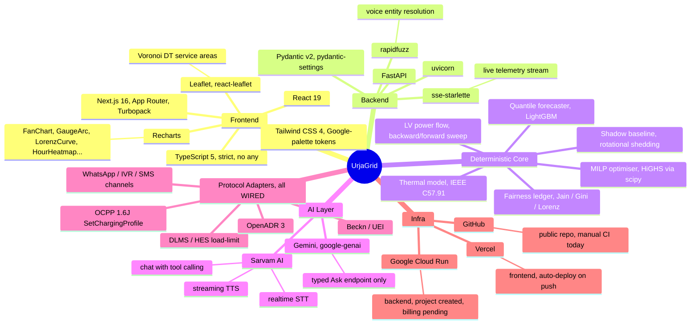
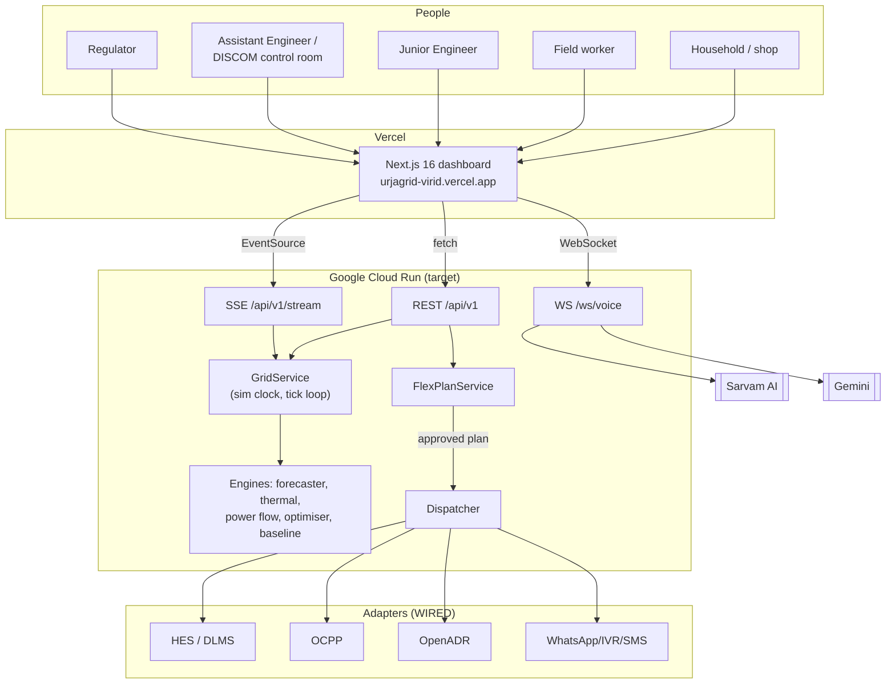
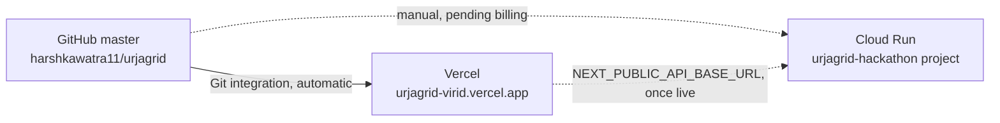

<div align="center">

# UrjaGrid

*Brownout, never blackout — forecast the deficit before it bites, try every softer lever first, and put a named engineer in the approval seat before anything touches a household's supply.*

[](https://urjagrid-virid.vercel.app)
[-4285F4?style=for-the-badge&logo=googlecloud&logoColor=white)](docs/DEPLOYMENT.md)
[](#testing-and-evaluation)
[](#testing-and-evaluation)
[](LICENSE)

[](https://nextjs.org)
[](https://www.typescriptlang.org)
[](https://fastapi.tiangolo.com)
[](https://lightgbm.readthedocs.io)
[](https://www.sarvam.ai)
[](https://ai.google.dev)

Submitted to **Schneider Electric's Yuva Yodha Energy Tech Hackathon — Problem Statement 3: Grid Reliability.**

[The problem](#1-the-problem) &middot;
[The loop](#2-how-it-works--the-seven-step-loop) &middot;
[Honest status](#3-whats-actually-real--honest-status-matrix) &middot;
[A map of the stack](#4-a-map-of-the-stack) &middot;
[Architecture](#5-architecture) &middot;
[The loop, end to end](#6-the-loop-end-to-end) &middot;
[Feature tour](#7-feature-tour-29-routes) &middot;
[Voice agent](#8-voice-agent-deep-dive) &middot;
[Deployed environments](#9-deployed-environments) &middot;
[Running it locally](#10-running-it-locally) &middot;
[Environment variables](#11-environment-variables) &middot;
[Testing](#12-testing-and-evaluation) &middot;
[Known limitations](#14-known-limitations)

</div>

---

## 1. The problem

India's distribution network loses reliability in a very specific, very fixable way:

- About **5.28 crore smart meters** are installed nationally, **3.90 crore of them under RDSS** (the government's own distribution-reform scheme), as of 31 Dec 2025 — and RDSS meters already support a **remote load-limit command**. That control point exists today; almost nothing uses it. ([PIB](https://www.pib.gov.in/PressReleasePage.aspx?PRID=2222217&reg=3&lang=2), [Prayas](https://energy.prayaspune.org/power-perspectives/smart-metering-in-india-a-work-in-progress))
- Average hours of power supply in FY25 were **22.6 h/day rural, 23.4 h/day urban** ([PIB](https://www.pib.gov.in/PressReleaseIframePage.aspx?PRID=2105394)) — real, measurable gaps remain even in the national aggregates.
- About **13 lakh distribution transformers fail every year (~10% of the installed base)**, mostly from sustained thermal overload a smarter dispatch could have avoided. ([Mercom India](https://www.mercomindia.com/cea-steps-in-as-distribution-transformer-failures-hit-1-3-million-a-year))
- When a shortfall does hit, the default DISCOM response is **rotational feeder shedding**: every household on a feeder loses power for the same block, regardless of whether they have a fridge of insulin, a shop that just opened, or nothing to lose at all. It is blunt, and it is the opposite of fair.

UrjaGrid's bet: the hardware for something better is already installed. What's missing is the software that forecasts the gap, tries every softer lever first, and puts a named engineer in the approval seat before anything touches a household's supply.

## 2. How it works — the seven-step loop

```
Sense → Forecast → Propose → Approve (human) → Dispatch → Confirm → Learn
```

Every hour, UrjaGrid forecasts demand and available supply for the next 36 hours, per distribution transformer (DT). When a shortfall or thermal overload is detected, it builds a **Flex Plan** that tries levers in a strict, always-the-same order — softest first:

| Lever | What it does |
|---|---|
| **L1** Behavioural DR | WhatsApp/IVR ask + Rs 2/kWh bill rebate to shift load voluntarily |
| **L2** Managed charging | OCPP `SetChargingProfile` slows e-rickshaw/EV charging hubs |
| **L3** Shiftable public loads | OpenADR signal to water pumps / telecom towers |
| **L4** Existing storage discharge | Draws down batteries already in the network |
| **L5** Lifeline caps | DLMS remote load-limit via HES — per household, with an expiry, never below a guaranteed floor |
| **L6** Rotational shedding | Status quo fallback — only when L1–L5 can't close the gap |

A named **Junior Engineer (JE)** must approve, edit, or reject every plan before anything dispatches — non-negotiable (see [`docs/WRITEUP.md`](docs/WRITEUP.md)). Approved plans go out as **Hindi notices two hours ahead**, then time-boxed commands to meters/chargers. Afterwards, meter readings verify the relief actually happened, DR rebates settle, and a fairness ledger rotates who carries the burden next time.

Three tiers protect the vulnerable automatically: **T0** (hospitals, life-support homes) is never capped, asked, or shed; **T1** households keep a guaranteed **≥300 W** lifeline; **T2** shops keep **≥500 W**; **T3** flexible assets (chargers, pumps) are shifted first.

## 3. What's actually real — honest status matrix

UrjaGrid tags every capability on screen, using these exact labels, reproduced verbatim as `<StatusTag>` chips on every dashboard page:

| Tag | Meaning | Examples in this build |
|---|---|---|
| 🟢 **LIVE** | Real algorithm/external service runs in the prototype | Weather ingestion, load-shape model, net-load forecaster (trained LightGBM), thermal model (IEEE C57.91), LV power flow, MILP optimiser, shadow baseline, voice (Sarvam STT/TTS), typed-ask agent (Gemini), auth |
| 🟡 **WIRED** | Spec-shaped code path against an in-process simulator — not real hardware | OCPP charger gateway, OpenADR VTN, DLMS/HES load-limit gateway, Beckn/UEI, WhatsApp/IVR/SMS channels, federation |
| 🔴 **PILOT** | Not built in this prototype | Real HES/MDM integration, India Energy Stack consent flows, production messaging contracts |

Nothing in this repo claims to be more finished than it is — see [Section 13](#13-system-health-heatmap) for a module-by-module breakdown and [Section 14](#14-known-limitations) for every honestly-disclosed gap, including two real bugs found and fixed while building this README (the SSE live-telemetry contract, and the Scenario Lab always reporting zero relief — see [`docs/IMPACT.md`](docs/IMPACT.md) Section 4).

## 4. A map of the stack

Every branch below is a real dependency in `package.json` or `requirements.txt`, not a wishlist.



## Technology cards

| Technology | Role here | Where |
|---|---|---|
| Next.js 16 (App Router, Turbopack) | 27 dashboard routes + 2 standalone apps, static generation everywhere it can be | `frontend/src/app/` |
| React 19 | Client islands: voice orb, live map layers, decision board | `frontend/src/components/` |
| TypeScript 5 (strict, no `any`) | One shared type set for every hook, page and card | `frontend/src/lib/api/types.ts` |
| Tailwind CSS 4 (CSS-first tokens) | Brand-green chrome + a genuine Google-inspired blue/green/red/yellow system for heatmaps, charts and status everywhere else | `frontend/src/app/globals.css`, `lib/heat.ts`, `lib/domain.ts` |
| Leaflet, react-leaflet | DT service-area (Voronoi) polygons, feeder/asset layers, live tick-driven colour via an imperative, non-React telemetry store | `frontend/src/components/map/`, `lib/live/telemetry-store.ts` |
| Recharts | Fan charts, waterfalls, Lorenz curve, gauges, heatmaps, thermal traces | `frontend/src/components/charts/` |
| FastAPI | ~19 routers under one ASGI app: REST, Server-Sent Events, WebSocket | `backend/app/main.py`, `backend/app/api/v1/` |
| Pydantic v2, pydantic-settings | Every request/response model and the single settings source | `backend/app/grid/models.py`, `backend/app/core/config.py` |
| sse-starlette | `GET /api/v1/stream`: `tick`/`event`/`plan`/`plans`/`risk`/`kpis` frames, camelCase, matching the frontend's typed contract exactly | `backend/app/services/stream.py` |
| rapidfuzz | Fuzzy resolution of spoken sub-division/transformer names in Hindi, Hinglish and English | `backend/app/tools/resolve.py` |
| LightGBM + split-conformal calibration | Per-DT P10/P50/P90 quantile forecaster, calibrated to 80% coverage on held-out data | `backend/app/grid/forecaster.py`, `backend/data/models/*.txt` |
| scipy (HiGHS) | MILP Flex Plan optimiser, with a tested greedy fallback | `backend/app/grid/optimizer.py` |
| Sarvam AI | Realtime speech-to-text, a chat model with tool calling, streaming text-to-speech for "Urja" | `backend/app/voice/` |
| Gemini (`google-genai`) | The typed Ask agent only — explanation, never prediction or decision | `backend/app/agents/ask_agent.py` |
| PyJWT + bcrypt | 6-role auth (consumer/field/je/ae/regulator/admin), demo-login, audited mutations | `backend/app/core/auth.py` |
| Vercel | Frontend hosting, Git-connected, deploys on every push to `master` | [urjagrid-virid.vercel.app](https://urjagrid-virid.vercel.app) |
| Google Cloud Run | Backend hosting target, Always-Free-tier config (`--min-instances 0 --max-instances 1`) | `backend/Dockerfile`, `docs/DEPLOYMENT.md` |
| Vitest, Pytest, Ruff | 162 frontend unit tests, 352 backend tests, backend lint | `frontend/src/**/*.test.ts*`, `backend/tests/` |

## What is in this repository

| Part | Location | Port | Role |
|---|---|---|---|
| FastAPI backend | `backend/` | 8080 | Simulation engines, Flex Plan state machine, dispatcher, protocol adapters, REST/SSE/WS API, voice, typed Ask agent |
| Next.js dashboard | `frontend/` | 3000 | Control room UI: command centre, plans desk, map, 20+ domain pages, consumer and field-worker apps |

## 5. Architecture



Full component, data-flow, energy-flow and money-flow diagrams (four Mermaid diagrams in total) are in [`docs/ARCHITECTURE.md`](docs/ARCHITECTURE.md).

Architecture principles that hold across every module:

- Deterministic engines compute the numbers (demand forecast, thermal limit, optimiser allocation, fairness index). Language models explain and phrase; they never decide.
- Every Flex Plan needs a human action (approve, edit or reject) before anything dispatches — enforced by a dedicated, never-skipped test suite (`backend/tests/test_invariants.py`, 6 hard safety invariants).
- The dashboard keeps working when the backend is down: every page renders from committed offline fixtures with a visible offline banner.
- Consumer-level data never leaves the DISCOM node; the Regulator role only ever sees aggregate figures.

## 6. The loop, end to end

The signature flow: a deficit is forecast, a JE approves a Flex Plan, it dispatches, and meters verify the relief.

```mermaid
sequenceDiagram
  participant JE as Junior Engineer
  participant D as Dashboard
  participant B as Backend
  participant A as Adapters (HES/OCPP/channels)
  participant M as Meters

  B->>B: Hourly: forecast gap per DT, build draft Flex Plan
  D->>B: GET /api/v1/plans (Awaiting column)
  JE->>D: Review levers, approve
  D->>B: POST /api/v1/plans/{id}/approve
  B->>B: Dispatcher schedules notify(T-120m)→signal(T-30m)→hes(T-15m)
  B->>A: Fire each step on schedule
  A->>M: WhatsApp/IVR notice, then DLMS load-limit / OCPP curtailment
  Note over B: Window runs; tick loop streams live DT telemetry over SSE
  M-->>B: Interval meter reads
  B->>B: M&V: verify realised relief, settle DR rebates, rotate fairness ledger
  B-->>D: SSE kpis/risk events: served fraction improves
  D-->>JE: Live KPI update, no reload
```

## 7. Feature tour (29 routes)

All dashboard pages are scope-aware: a sub-division scope is kept via the `ScopeProvider` and a 6-role `RoleProvider` gates mutations.

| Group | Page | Route | Notes |
|---|---|---|---|
| Command | Grid Command Centre | `/command` | Situation banner, live map, league table, 24h heatmap — the flagship overview |
| Command | Voice Control Room | `/voice` | Urja orb, text-first conversation, 12 grid fact-card types |
| Command | Scenario Lab | `/scenario` | 4 built-in presets, live "Run" against the real network, national-impact matrix |
| Plans | Flex Plans | `/plans` | 5-column Kanban (Awaiting/Scheduled/Active/Verified/Rejected), what-if panel |
| Plans | Plan case file | `/plans/[planId]` | Lever waterfall, options table, dispatch stepper, decision bar |
| Grid | Sub-division Lab | `/subdivisions` | Small multiples, CEEW calibration bars, quadrant scatter |
| Grid | Sub-division detail | `/subdivisions/[id]` | Deep dive + printable A4 scorecard |
| Grid | Transformers | `/transformers` | 5-lens tile grid (Risk/Loading/Hot-spot/Voltage/Served) |
| Grid | Transformer case file | `/transformers/[dtId]` | Fan chart forecast, gauges, meter wall, single-line diagram |
| Grid | Map | `/map` | Leaflet GIS console, Voronoi service areas, selection drawer |
| Grid | Feeders | `/feeders` | Solution-vs-baseline on/off strip, loading, hours-off |
| Flex | Live Grid Ops | `/flex` | Live map, meter counters, active plans, command feed |
| Flex | Managed Charging | `/flex/chargers` | OCPP fleet status, curtailment chart |
| Flex | Storage & P2P | `/flex/storage` | SoC/dispatch, Beckn trade ledger |
| Flex | Demand Response | `/flex/dr` | Beta-Bernoulli acceptance belief density per sub-division |
| Flex | Lifeline & Fairness | `/flex/lifeline` | Jain/Gini, Lorenz curve, the 6 safety-invariant checklist |
| Insights | Forecast Studio | `/forecast` | Fan chart, WAPE/skill/coverage backtest KPIs |
| Insights | Reliability | `/reliability` | 6 solution-vs-baseline compare stats |
| Insights | Transformer Health | `/thermal` | Overload/trip stats, loss-of-life |
| Insights | Voltage & Losses | `/power-quality` | Diverging voltage scale (under/nominal/over) |
| Insights | Critical Loads | `/critical` | T0 facility + life-support registry |
| Insights | Consumers & Channels | `/consumers` | Message outbox, phone-preview |
| Insights | Analytics | `/analytics` | Audit log, role/permission matrix |
| Insights | Economics | `/economics` | Assumption sliders, money-flow diagram, BCR |
| Insights | Protocols | `/protocols` | 7 protocol status cards, payload inspector |
| Insights | Regulator View | `/regulator` | 2 DISCOM-node cards, aggregates-only, federation diagram |
| Standalone | Consumer app | `/consumer` | Hindi-default phone app: बिजली मौसम status, DR accept, Ask Urja |
| Standalone | Field worker app | `/field` | Role-gated: life-support registration, outage reports |

## 8. Voice agent, deep dive

"Urja" is a WebSocket endpoint (`/ws/voice`), text-first in this build (no mic capture/audio playback — see [Known limitations](#14-known-limitations)):

- **Grounding rule.** Every grid-specific fact must come from one of 15 read-only tools in the same conversation; the agent never fabricates a name or number, and cannot approve, reject, dispatch or cancel anything — it always directs action to a JE/AE.
- **Language.** Responds in whichever of English/Hindi/Hinglish the user wrote in.
- **STT/TTS.** Designed for Sarvam AI (`saaras:v3-realtime` STT, `sarvam-105b-conversations` chat, `bulbul:v3` TTS speaker "simran"), with a deterministic mock client when `SARVAM_API_KEY` is unset so the whole pipeline is unit-testable without a live key.
- **Fact cards.** 12 structured card types (subdivision, transformer, deficits, ranking, plans, plan, levers, critical, reliability, forecast, fairness, circle summary) rendered next to the transcript.

> **AI provider architecture, stated plainly.** Sarvam AI is the only model in the voice path. Gemini (`google-genai`) is wired to the separate typed `AskAgent` only. Neither model ever produces a number that wasn't already computed by a deterministic engine — the forecaster, thermal model, optimiser and baseline have no model in them at all.

## 9. Deployed environments



- **GitHub.** [github.com/harshkawatra11/urjagrid](https://github.com/harshkawatra11/urjagrid), public.
- **Frontend.** Live at **[urjagrid-virid.vercel.app](https://urjagrid-virid.vercel.app)**. The Vercel project (`harsh-s-vercel-team/urjagrid`) is Git-connected to this repo's `master` branch — every push builds and promotes to production automatically. Runs entirely against committed offline fixtures until the backend below is deployed.
- **Backend.** A dedicated GCP project, `urjagrid-hackathon`, is created and ready. It has **no billing account linked yet** — a deliberate pause point: Cloud Run needs billing enabled even for Always-Free-tier usage, and linking one was left for the project owner to action explicitly rather than done automatically. Full deploy steps, pinned to stay inside the free tier (`--min-instances 0 --max-instances 1`), are in [`docs/DEPLOYMENT.md`](docs/DEPLOYMENT.md).

## 10. Running it locally

### Backend (FastAPI, Python 3.12)

```powershell
cd backend
py -3.12 -m venv .venv
.venv\Scripts\python -m pip install -r requirements.txt
.venv\Scripts\python -m pytest -q      # 352 tests, should all pass
.venv\Scripts\python -m uvicorn app.main:app --host 127.0.0.1 --port 8080 --reload
```

### Frontend (Next.js 16, TypeScript)

```powershell
cd frontend
npm install
npm run dev     # http://localhost:3000
```

### One-shot demo script

```powershell
.\start-demo.ps1
```

Verifies `backend/.venv` exists, runs the backend's pytest suite as a smoke check, then starts uvicorn on `127.0.0.1:8080`. Pass `-SkipTests` to skip the smoke check, `-Port <n>` to use a different port.

### Health checks

```bash
curl -s -o /dev/null -w "%{http_code}\n" http://127.0.0.1:8080/health
curl -N --max-time 3 http://127.0.0.1:8080/api/v1/stream      # should print "event: tick"
```

## 11. Environment variables

None of the values below are real. Never commit `.env*` files; `backend/.env` and `frontend/.env.local` are gitignored.

### `backend/.env`

`backend/.env.example` lists every key with an empty value.

| Key | Default | Purpose |
|---|---|---|
| `GEMINI_API_KEY` | none | Typed Ask agent; a deterministic mock client runs without it |
| `SARVAM_API_KEY` | none | Voice STT/TTS; a deterministic mock client runs without it |
| `LIFELINE_TIME_SCALE` | `60` | Simulated seconds per real second (`1` is real time) |
| `LIFELINE_ADMIN_ENABLED` | `true` locally | Sim-control endpoints (reset/jump/autopilot) |
| `LIFELINE_TWILIO_ENABLED` | `false` | Optional real WhatsApp sandbox transport; mock transport otherwise |
| `JWT_SECRET` | dev default | Session signing — set a real secret before any non-local deploy |
| `CORS_ORIGINS` | localhost/127.0.0.1 on 3000 | Allowed frontend origins |

(`LIFELINE_*` is a subsystem prefix predating the product's current name, kept for the same reason domain terms like "lifeline cap/floor" are unrelated to branding — see the rebrand note in the repo history.)

### `frontend/.env.local`

| Key | Example | Purpose |
|---|---|---|
| `NEXT_PUBLIC_API_BASE_URL` | `http://127.0.0.1:8080` | REST/SSE base. Inlined at build time. |

## 12. Testing and evaluation

Current counts: **352 backend tests, 162 frontend tests.**

```bash
# backend (from backend/, venv active)
python -m ruff check .
python -m pytest -q                          # 352 tests

# frontend (from frontend/)
npx tsc --noEmit
npx eslint .
npx vitest run                                # 162 tests
npx next build
```

## 13. System health heatmap

🟢 solid · 🟡 partial · 🔴 known gap.

| Module | Backend tests | Frontend tests | Live in production | Data realism |
|---|---|---|---|---|
| Simulation engines (forecast, thermal, power flow, optimiser) | 🟢 | n/a | 🟡 backend not yet deployed | 🟢 real IEEE C57.91/LightGBM/HiGHS, calibrated network |
| Flex Plan state machine + dispatcher | 🟢 | 🟢 | 🟡 backend not yet deployed | 🟢 real approve/reject/dispatch timeline |
| Scenario Lab | 🟢 | 🟢 | 🟡 backend not yet deployed | 🟢 real network, real auto-approved plans (fixed — see `docs/IMPACT.md` §4) |
| Live telemetry (SSE) | 🟢 | 🟢 | 🟡 backend not yet deployed | 🟢 real per-DT tick frames, contract-matched to the frontend |
| Protocol adapters (HES/OCPP/OpenADR/Beckn/channels) | 🟢 | 🟢 | 🟡 backend not yet deployed | 🟡 WIRED — in-process simulators, not real hardware |
| Voice agent | 🟢 | 🟢 | 🟡 backend not yet deployed | 🟡 text-first only; real Sarvam/Gemini clients with mock fallback |
| 29-route dashboard | n/a | 🟢 | 🟢 live on Vercel | 🟡 offline-fixture rendering until backend deploys |

## 14. Known limitations

- **Backend not yet deployed.** The GCP project exists but has no billing linked, so the live frontend currently runs entirely on committed offline fixtures. See [`docs/DEPLOYMENT.md`](docs/DEPLOYMENT.md) for the exact steps once billing is linked.
- **Voice is text-first only.** No microphone capture or audio playback in this build — the WebSocket protocol, grounding logic and fact cards are real and tested, but the audio I/O layer from the reference project was deliberately not ported for this foundation pass.
- **No CI/CD pipeline configured yet.** Tests, lint and build are all run manually (commands above); there is no GitHub Actions workflow in `.github/workflows/` gating pushes. Naming this here rather than leaving it implicit.
- **Scenario Lab's relief numbers are real but mixed.** Two of four built-in scenarios show positive relief vs. the shadow baseline; two show small negative relief, from a genuine interaction between a once-solved plan's constant levers and per-interval-independent rotational shedding. Traced and explained, not hidden — see `docs/IMPACT.md` §4.
- **No full-network optimiser run.** The MILP optimiser's lever-order logic is verified at single-DT test-case scale (`backend/tests/test_optimizer.py`); a simultaneous 48-DT run wasn't built in this pass.
- **Several frontend data hooks are fixture-only by design**, not a bug: consumer status, complaints, chargers/storage asset registries, and DR belief curves have no backing per-asset data model yet in the simulation core, so inventing live numbers for them would be dishonest. They render correctly from fixtures with `offline: true`.
- **No real screenshots.** No hosted browser session was available while building this repo's docs, so none are included — see [`docs/WRITEUP.md`](docs/WRITEUP.md) for exactly what to capture for a live demo recording.

## Further reading

- [`docs/SPEC.md`](docs/SPEC.md) — full condensed technical specification (architecture, data models, numeric constants, the original 21-day lane plan)
- [`docs/WRITEUP.md`](docs/WRITEUP.md) — full solution write-up: problem, solution, why India, key assumptions, why a human must approve
- [`docs/ARCHITECTURE.md`](docs/ARCHITECTURE.md) — component diagram + data/energy/money flow diagrams (Mermaid)
- [`docs/IMPACT.md`](docs/IMPACT.md) — quantified benefit vs. baseline, measured by actually running the backend
- [`docs/DEPLOYMENT.md`](docs/DEPLOYMENT.md) — deployment architecture + six-week pilot / scale-up plan
- [`docs/DESIGN_ARTIFACTS.md`](docs/DESIGN_ARTIFACTS.md) — where the design artifacts actually live in this codebase

Repo layout: `backend/app/{core,api/v1,grid,adapters,services,tools,agents,voice}`, `backend/data/{weather,scenarios,models,network}`, `backend/scripts/`, `backend/tests/`; `frontend/src/{app,components,lib,data/fixtures}`; `docs/`.

## License

MIT. See [`LICENSE`](LICENSE).

<div align="center">

*Every number is either computed, or it says where it came from.*

</div>
