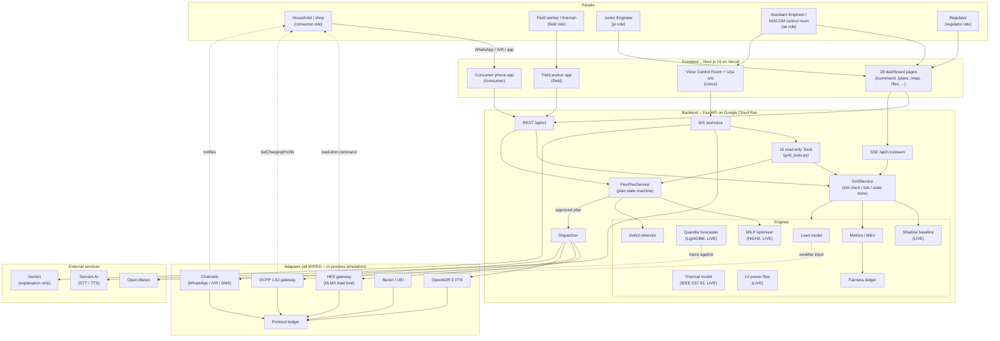
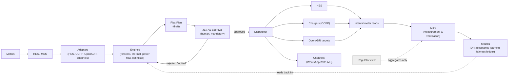
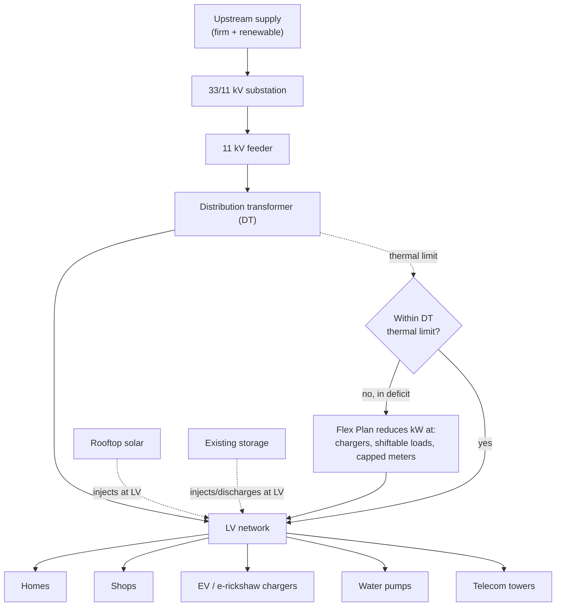
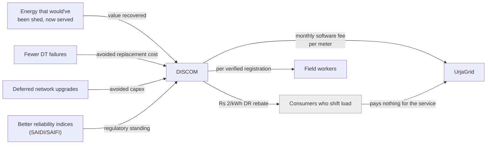

# UrjaGrid — System Architecture

Source of truth: `docs/SPEC.md` section 2 ("System Architecture"). This document renders that section as four Mermaid diagrams: one component diagram, and one each for the data, energy, and money flows.

---

## 1. Component diagram

## 2. Data flow

Consumer-level data never leaves the DISCOM node. The Regulator role only ever sees aggregate reliability/flexibility/fairness figures — never a named household's data.

## 3. Energy flow

In a deficit, the active Flex Plan reduces kW draw at chargers, shiftable public loads, and capped meters — in that lever order — until demand fits both the available upstream supply and each DT's own thermal limit.

## 4. Money flow

DISCOM pays a per-meter monthly software fee; consumers pay nothing for the service itself (DR participants are paid a rebate, not charged). The DISCOM's return comes from energy that would otherwise have been shed, fewer DT failures, deferred capital upgrades, and improved reliability indices. See `docs/IMPACT.md` for the actual numbers produced by `backend/app/services/economics.py`.
